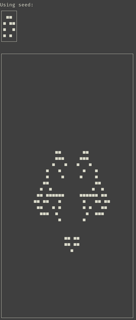

# novel-life
Novelty search discovers interesting seeds for the Game of Life.



## Usage
``` shell
cd novel-life
cargo run --release
```
(assuming [cargo](https://doc.rust-lang.org/book/ch01-03-hello-cargo.html) is installed)

If you don't get any output, novelty search hasn't found an "interesting" pattern. Just run it again.

## Help
``` shell
cargo run --release -- --help
```

## What does "interesting" mean?
Interesting is [currently defined as](https://github.com/jakobj/novel-life/blob/main/novel-life/src/novelty_search.rs#L17) more than 20 alive cells and 10 symmetric pairs (two cells that appear equally far from the middle of the universe in one row) at the end of the simulation. There's no deeper meaning to these settings, but they result in patterns that are somewhat pleasing to observe. Feel free to get creative here!
